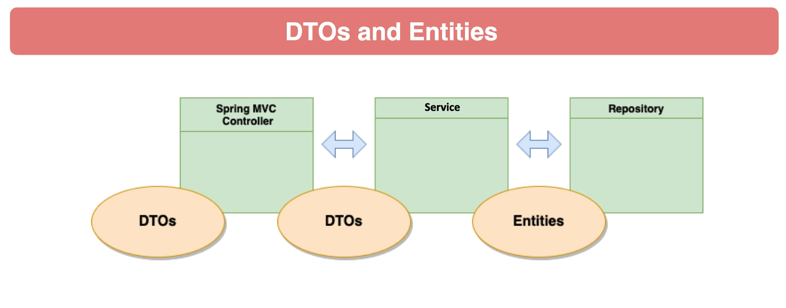

## Spring DevTools
### Setting up Spring auto-reload in IntelliJ

1. Add spring-boot-devtools as maven dependency
2. In IntelliJ community edition set make sure to check the checkbox in Settings -> Build, Execution, Deployment -> Compiler -> Build project automatically
3. Now if you run the spring application, modify a file and recompile/rebuild that file or the entire project then the devtools will automatically rerun the Spring application

**Authorization Server** project needed for **OAuth2.0 Client Credentials**: https://github.com/nandorrefi/spring-6-auth-server

### Notes

Dev tools provides useful features for development. For example it attaches the stack trace to failed responses.

These features are a security concern in production, but thankfully devtools are automatically disabled when the application gets launched from a jar or a special classloader.

Exact quote from the 3.3.5 [Spring documentation](https://docs.spring.io/spring-boot/reference/using/devtools.html#page-title):
> Developer tools are automatically disabled when running a fully packaged application. If your application is launched from java -jar or if it is started from a special classloader, then it is considered a “production application”. You can control this behavior by using the spring.devtools.restart.enabled system property. To enable devtools, irrespective of the classloader used to launch your application, set the -Dspring.devtools.restart.enabled=true system property. This must not be done in a production environment where running devtools is a security risk. To disable devtools, exclude the dependency or set the -Dspring.devtools.restart.enabled=false system property.

## Jayway JsonPath

https://github.com/json-path/JsonPath

## Spring Data JPA

**Java Persistence API (JPA)**: It is a Java specification that gives some functionality and standard to ORM tools.

**Hibernate**: A Java ORM framework that simplifies the interaction with the database. An implementation of the JPA specification.

### Data Transfer Objects (DTOs)

POJOs with NO behavior

DTOs only used for transferring data between producers and consumers

### Why not use entities as DTOs?

In a more complex application it is important to separate the DB data from the API response data

Entities represent the tables in the database, we usually don't want to return every column from a table to the client

Consumers have different needs than the needs of persistence

### Type Conversions

Type Conversions are often done within methods but it is **best practice** to use dedicated converter components

Spring Framework provides a Converter interface with generics, can be used with our dedicated converter component

[MapStruct](https://mapstruct.org/documentation/reference-guide/) is a code generator which automates generation of type converters, kinda like Lombok

## Flyway

### SQL flavours

If flyway is having issues with understanding your SQL script because it contains database specific keywords, 
then you can use "vendor" in the location of the file: 
https://docs.spring.io/spring-boot/docs/3.0.0-M5/reference/htmlsingle/#howto.data-initialization.migration-tool.flyway

You can even overwrite FlywayProperties to tweak settings if needed.

In general the default autoconfigured flyway should work for most cases.

## Spring Boot Test Containers

Puts your Spring Boot application into a docker container. 

Test Containers are for integration testing with databases, message brokers, auth servers, etc.

Spring Boot support allows for easy detection of Test Containers and configuration for running the integration tests.

Documentation: https://docs.spring.io/spring-boot/reference/testing/testcontainers.html

### Testing Optimization

In the maven failsafe plugin we can separate the unit tests from the integration tests

If we use \*IT or IT\* or \*ITCase naming in our test file, then we can set it up to run these tests during the "verify" lifecycle in maven.

During the "test" lifecycle we can still trigger our faster unit tests for development.

Generally unit tests should be run frequently, integration tests should be run more rarely.

Documentation: https://maven.apache.org/surefire/maven-failsafe-plugin/integration-test-mojo.html

### Spring Boot Docker Compose

Using a root compose.yaml file we can run the services in a docker container that your application depends on.

To use docker compose, specify the following in the application.properties config file:
> spring.docker.compose.enabled=true

With this setting, on startup the application runs the compose file which will create the specified Docker containers.

This setting can also override connection settings specified in the application.properties file. For example, if we specify a database in the compose file, then the JDBC username, password and URL will be overwritten to use the Docker container database instance.

By using Docker your application can become easily portable to multiple platforms and also set up true integration testing in a production-like environment.

## CS File Upload

Useful lib for this is **opencsv**: https://opencsv.sourceforge.net/

## Spring Security

Spring Security provides authentication, authorization and protection against common attacks.

After pulling in the dependency, Spring Security configures a user named "user" by default. 
The password for this user can be seen in the logs after running the application.

Spring Security will also configure basic auth on all endpoints by default. 

**Basic Authentication:** A base64 encoded free text username:password pair is sent in the header of the request. 
Because it is a free text we should only use HTTPS protocol when using it. 
Simple, but there are more secure solutions that should be used rather than basic auth.

Spring Security provides protection against Cross Site Request Forgery (CSRF): https://docs.spring.io/spring-security/reference/servlet/exploits/csrf.html

CSRF protection is only needed for web page endpoints, if we are using a REST API without cookies, then we do not need CSRF protection.